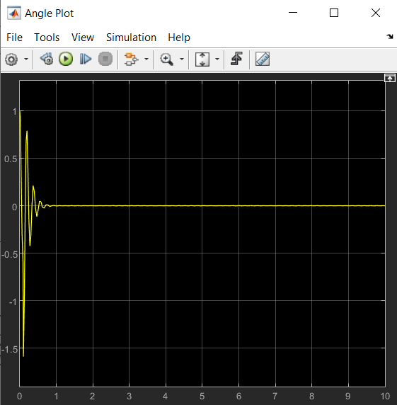
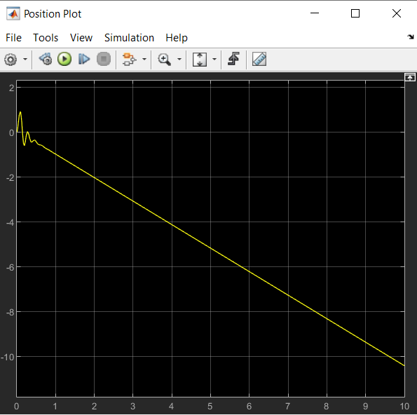
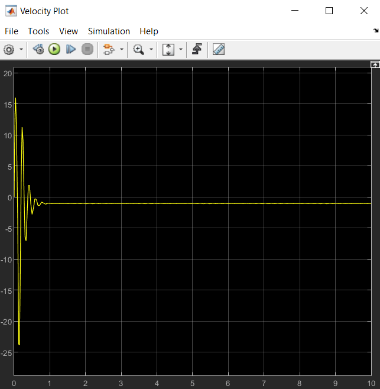
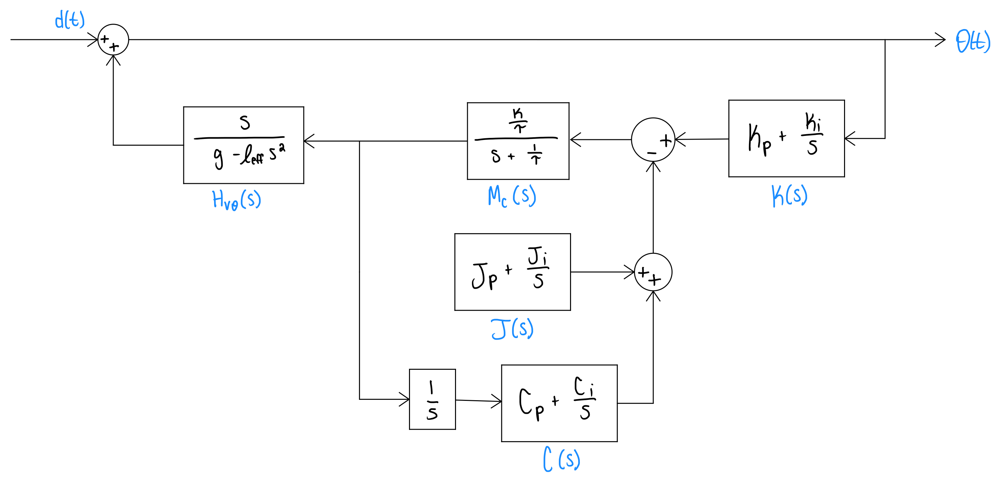
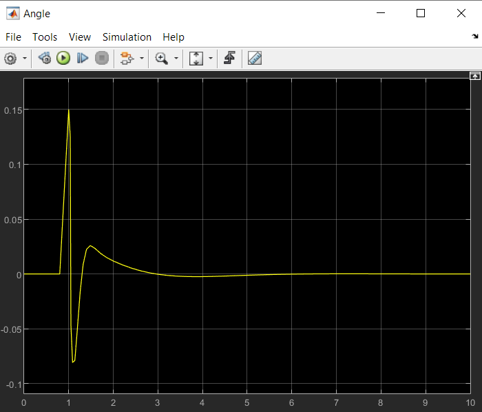
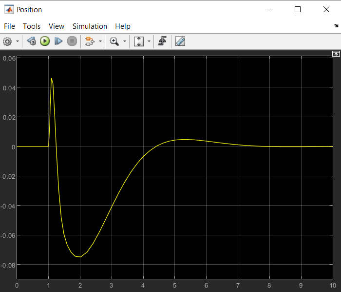
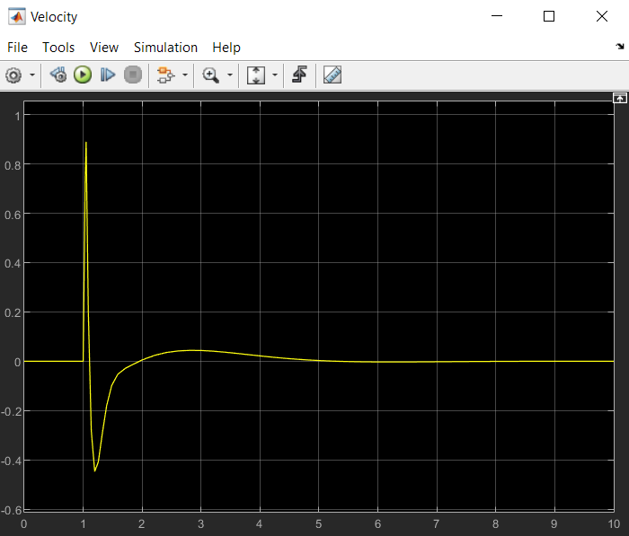

# Stationary Balacing Robot Control Project
*Featuring: Rockilton "Large-cliff" McGee IV*

## Initial System
### Motor Parameter Estimation
Given a transfer function for the motors:
$$M(s) = \frac{V(s)}{V_c(s)} = \frac{\frac{K}{\tau}}{s + \frac{1}{\tau}}$$

Given a unit step input of $v_c(t) = V_{step} * u(t)$, the time domain reponse for $v(t)$ is given by:
$$v(t) = V_{step}K(1 - e^{\frac{1}{\tau}t})$$

Linear velocity data was collected for each wheel of Rocky for a step input of $V_{step} = 300$. By fitting the time domain response equation to the collected data, the motor parameters $K$ and $\tau$ for each motor were determined to be:

$$K_{left} = 0.002749$$
$$\tau_{left} = 0.05256s$$
$$K_{right} = 0.002598$$
$$\tau_{right} = 0.05817s$$

### Gyroscope Calibration
To calibrate the gyroscope, the gyroscope output values were recorded with Rocky lying horizontally and vertically:

- Horizontal Reading: $\pm 1.66$
- Vertical: 0.26
- Fixed Angle Correction: 0.26

### Natural Frequency and Effective Length
To calculate the natural frequency of the system, gyroscope data was collected while Rocky swung back and forth. Plotting the gyroscope data over time, the period of the first swing was found to be 1.3 seconds.

From there, the natural frequency was calculated:

$$\omega_{n} = 2\pi*\frac{1}{1.3} = 4.8332\ rad/s$$

Using the natural frequency, the effective length of the rod was determined as follows:

$$\omega_{n} = \sqrt{\frac{g}{l_{eff}}}$$
$$l_{eff} = \frac{g}{\omega_{n}^2} = \frac{9.81}{4.8332^2} = 0.4199\ m$$

### Poles

The initial balancing model has three poles: one real pole and two imaginary ones. In order for Rocky to balance after a disturbance, the imaginary poles are dominant. This way, Rocky will oscilate and eventually settle. For Rocky to recovery quicly (in less than 1s), the real pole was chosen to be a large negative number. The imaginary part of the dominant poles is relatively small as not to cause too large of an over reaction from a disturbance. The chosen poles are as follows:

$$Pole\ 1 = -7 + 0.5\pi i $$

$$Pole\ 2 = -7 - 0.5\pi i $$

$$Pole\ 3 = -50 $$

### Controller Parameters

The closed loop control system for the initial balancing robot is as follows:

where $H_v\theta(s)$ is the transfer function of the robot, $M_c(s)$ is the transfer function for the wheel motors, and $K(s)$ is a PI controller.

The controller parameters, Kp and Ki were determined using the poles above and the provided "Rocky_closed_loop_poles_23.m" MATLAB script:

$$K_p = 12278$$

$$K_i = 45050$$

### Simulink Model
Below is a MATLAB Simulink Model of the control loop, using the determined controller parameters, along with graphs of the angle, velocity, and position over time. 

</img>

</img>

</img>

With the balancing (non stationary) model, the output behavior shows Rocky stable, but moving at a constant velocity. A new model with added control loops will allow Rocky stay in one place while balancing. 

## Stationary Balancing System
The initial system controls balancing the Rocky by angle, but does not prevent it from moving forward or backwards. Additional control loops to control for displacement and velocity are necessary to create a stationary balancing system.

### Poles
The stationary balancing system has five poles: three real poles and two imaginary poles (complex conjugate pair). The pair of imaginary poles are dominant, and thus have real components that are the furthest towards the right on the real axis of the pole plot. The imaginary component is relatively small as to not cause too large of an oscillatory response from a disturbance. The poles were tuned experimentally. The chosen poles are as follows:

$$Pole\ 1 = -1 + i $$
$$Pole\ 2 = -1 - i $$
$$Pole\ 3 = -10 $$
$$Pole\ 4 = -8 $$
$$Pole\ 5 = -5 $$

### Simulink Model
Below is a MATLAB Simulink Model of the control loop for the stationary balancing system, using the determined control parameters.

Below are the simulation plots for angle, velocity, and position are.

</img>

</img>

</img>

### Demos
